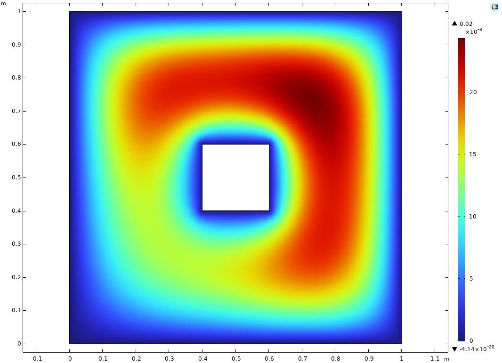
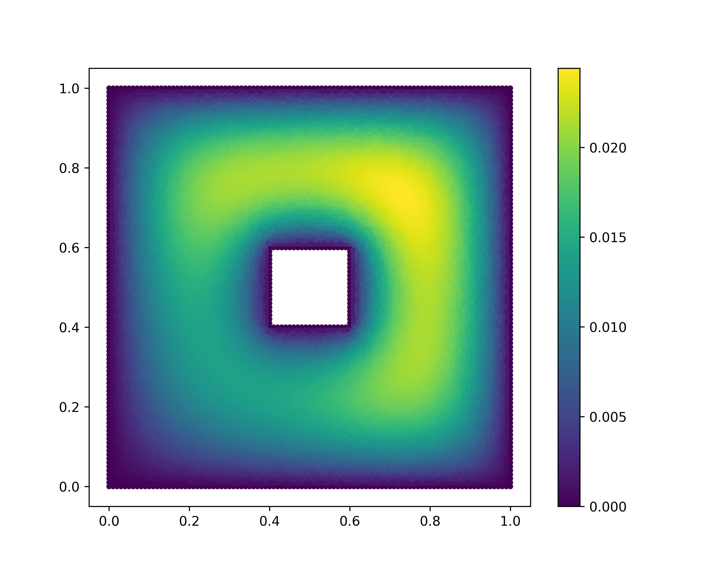

# Taichi_FEM_DEM_doubleLayerRepulsion

### 团队名：我在搓泥巴

### 项目名：颗粒间双电层斥力求解与作用

### 项目介绍：

胶体体系（如黏土、牛奶、人体血液等）中颗粒的作用力主要为以下三种：范德华吸引力、双电层排斥力、物理接触力。

（1）求解过程：颗粒之间的双电层斥力，普遍采用有限单元法对Poisson-Boltzmann方程（PB方程）进行求解来获得。

（2）运动过程：颗粒在双电层斥力下的运动，则需要将上述PB方程求解的结果进行拟合或者简化为“力与距离”的表达式，代入到离散单元法中进行求解。

在当前的研究中，（1）求解过程与（2）运动过程是分开实现，且对PB方程的结果进行拟合或简化会存在一定的误差，因此本项目拟使用Taichi，在每个时间步内通过有限单元法对颗粒之间的双电层斥力进行求解，并使用离散单元法对颗粒的速度与位置进行更新。

##
### 2022/12/03 更新

     （1）求解Poisson-Boltzmann方程（PB方程）改为求解Poisson方程
      
  Poisson-Boltzmann方程( $a$ 、 $b$ 为常数， $\psi$ 为电势)：
  
  $$ \Delta \psi = a*sinh(b*\psi)$$
  
  Poisson方程( $f$ 为普通函数，如： $sin(x+y)$ 、 $1.0$ 、 $x^2$ 等)：
  
  
  $$ \Delta \psi = f$$
      
  taichi中稀疏矩阵的创建与计算(主要求解线性方程组)，在规模比较大的情况下，稀疏矩阵的存取会比较慢（相较于scipy与numpy而言）。
  
  而PB方程的求解需要用到稀疏矩阵多次迭代求解，在数据量比较大的情况下计算会很慢，考虑到项目的重点是采用taichi来尝试进行有限元计算，因此本项目将PB方程的求解改为普通Poisson方程的求解（二者的差别仅在于PB方程右侧是一个双曲正弦函数，需要多次迭代求解，而普通Poisson方程只需一次求解即可）。期待taichi以后能有更多稀疏矩阵计算的功能～

 下图为分别使用商业有限元软件COMSOL、taichi + gmsh、numpy+scipy+gmsh对Poisson方程中f=sin(x+y)情况下的求解结果，边界条件为Dirichlet条件。此步骤的目的是通过商业软件验算自己代码计算结果的可靠性。
 
       

     （2）离散元部分的内容暂时做不完了，Hackathon之后再接着做
下次一定找队友组队，一起搞

     （3）对比taichi+gmsh、numpy+scipy+gmsh、Matlab三者的划分网格与组装矩阵的速度（不包含计算）
     
     

     
     
##
#### 参考资料

有限单元法求解双电层排斥力：

1991-Numerical Study of The Electrical Double-Layer Repulsion Between Nonparallel Clay Particles of Finite Length[J]. International Journal for Numerical and Analytical Methods in Geomechanics[doi:10.1002/nag.1610151002](https://onlinelibrary.wiley.com/doi/10.1002/nag.1610151002)

2020-Numerical Studies on Electrical Interaction Forces and Free Energy between Colloidal Plates of Finite Size[J]. LANGMUIR [doi:10.1021/acs.langmuir.9b02981](https://pubs.acs.org/doi/10.1021/acs.langmuir.9b02981)

离散单元法应用双电层斥力：

2003-Three-Dimensional Discrete Element Method of Analysis of Clays[J]. Journal of Engineering Mechanics [doi:10.1061/(asce)0733-9399(2003)129:6(585)](https://ascelibrary.org/doi/10.1061/%28ASCE%290733-9399%282003%29129%3A6%28585%29)

2022-Discrete-element simulation of drying effect on the volume and equivalent effective stress of kaolinite[J]. Géotechnique [doi:10.1680/jgeot.18.P.239](https://www.icevirtuallibrary.com/doi/full/10.1680/jgeot.18.P.239)
